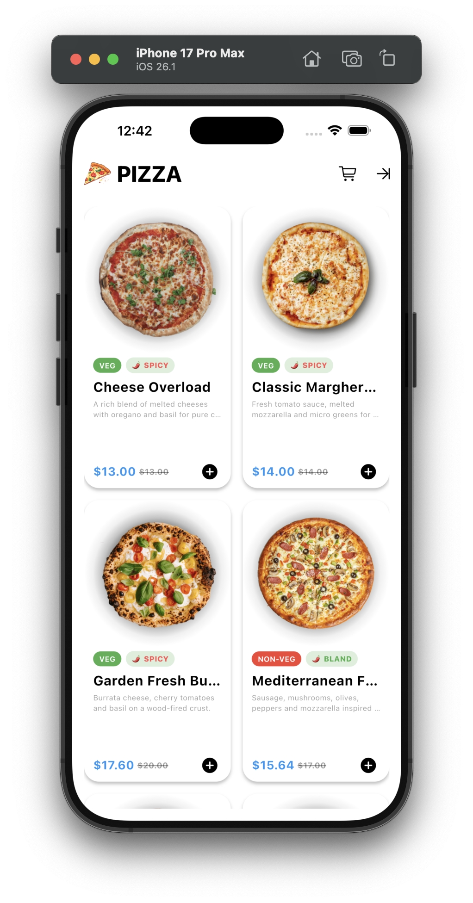
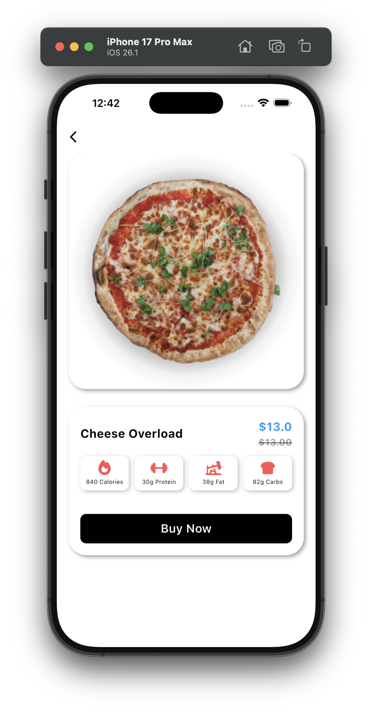
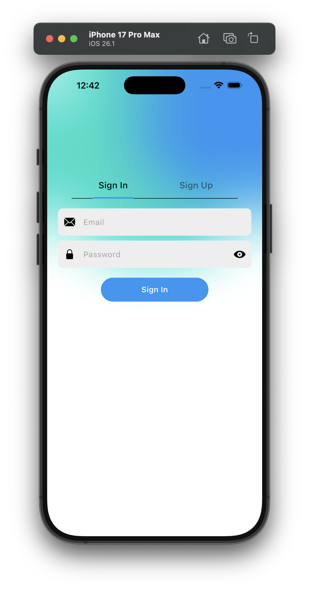

# 🍕 Pizza Shop Flutter

A modern pizza shop mobile application built with **Flutter**, using **BLoC + Repository architecture** and **Firebase Firestore**.

---

## 🚀 Features

- User Sign In / Sign Up / Sign Out
- Firebase Firestore integration
- Fetch pizzas from database
- Product grid list
- Discounts & price calculation
- Responsive UI (iOS & Android)
- Clean BLoC state management
- JSON → Firestore bulk import support

---

## 🧩 Tech Stack

- Flutter
- Dart
- Firebase Firestore
- Firebase Auth
- flutter_bloc
- equatable

---

## 🏗 Architecture

lib/
├─ blocs/
├─ screens/
├─ components/
├─ app.dart
└─ main.dart

Uses a clean structure with:
- Presentation Layer (UI + BLoC)
- Data Layer (Repositories)
- Models

---

## 📸 Screenshots

  

    
    
<b>Home Screen</b>

  

  

    
    
<b>Details Screen</b>

  

  

    
    
<b>Login Screen</b>

  

  
    

    
    
<b>Sign up Screen</b>

  

---

## 🗄 Firestore Data Structure

**Collection name:** `pizzas`

pizzaId: string
name: string
description: string
picture: string
isVeg: boolean
spicy: number
price: number
discount: number
macros:
calories: number
proteins: number
fat: number
carbs: number

---

## 📥 Importing Pizza Data

1. Add `pizzas.json` to the `assets` folder.
2. Run the import script:

flutter run -t import_pizzas.dart

This uploads all pizzas to Firestore automatically.

---

## ▶️ Running the App

flutter pub get
flutter run

Make sure Firebase is configured for your platform.

---

## ✅ Future Improvements

- Cart & checkout system
- Payment integration
- Favorites
- Push notifications

---

## 👤 Author

**Osman Şimşek**  
GitHub: https://github.com/osman0simsek

---

## 📜 License

MIT License

